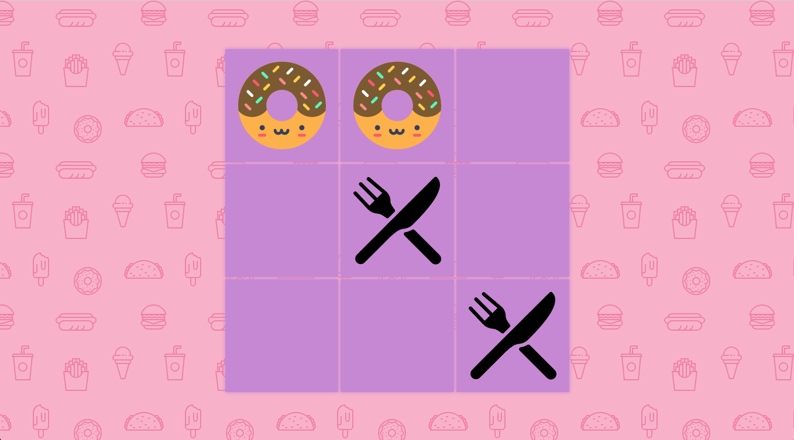

# NicNacNope
A food-themed tic-tac-toe game. Built for FreeCodeCamp.

## Stack
- [Unlimited Machine Works](https://unlimited-machine-works.surge.sh/) - My lightweight state machine library.
- [react-umw](https://github.com/johnpaulada/react-umw) - Unlimited Machine Works React bindings.
- [Create React App](https://github.com/facebook/create-react-app) - No config React setup.
- [styled-components](https://www.styled-components.com/) - I like CSS-in-JS.
- [Animate.css](https://github.com/daneden/animate.css) - Easy drop-in animations.
- [SweetAlert](https://sweetalert.js.org/) - A beautiful replacement for alert boxes.
- [Hero Patterns](http://www.heropatterns.com/) - Repeating SVG Backgrounds.

## Icon Credits
- 
Icons made by <a href="https://www.flaticon.com/authors/pixel-perfect" title="Pixel perfect">Pixel perfect</a> from <a href="https://www.flaticon.com/" title="Flaticon">www.flaticon.com</a> is licensed by <a href="http://creativecommons.org/licenses/by/3.0/" title="Creative Commons BY 3.0" target="_blank">CC 3.0 BY</a>

- 
Icons made by <a href="http://www.freepik.com" title="Freepik">Freepik</a> from <a href="https://www.flaticon.com/" title="Flaticon">www.flaticon.com</a> is licensed by <a href="http://creativecommons.org/licenses/by/3.0/" title="Creative Commons BY 3.0" target="_blank">CC 3.0 BY</a>

Icons made by <a href="https://www.flaticon.com/authors/smashicons" title="Smashicons">Smashicons</a> from <a href="https://www.flaticon.com/" title="Flaticon">www.flaticon.com</a> is licensed by <a href="http://creativecommons.org/licenses/by/3.0/" title="Creative Commons BY 3.0" target="_blank">CC 3.0 BY</a>

## License
MIT